# Planner (build in Hackrush-2021)

### A web portal that provides an efficient and intuitive way to track graduation requirements and grades.

<!--ts-->
## [Table of contents](#table-of-contents)
- [Components of the project](#components-of-the-project)
    - [Pages](#pages)
    - [Screenshots of Website](#screenshots-of-website)
    - [Files & Folders](#files-and-folder)
    - [How to run](#how-to-run)
    - [Contributors](#contributors)
<!--te-->

## [Components of the project](#components-of-the-project)
 - `MongoDB` online database
 - `Express` server
 - `React` + `react-bootstrap` client
 - Course parser from csv file

## [Pages](#pages)
 - Home page
 - Login Page
 - Logout Page
 - Dashboard
 - Edit Plan
    - Create new plan page
    - Edit plan page(availabe through load plan)
 - Shared plan

## [Screenshots of Website](#screenshots-of-website)
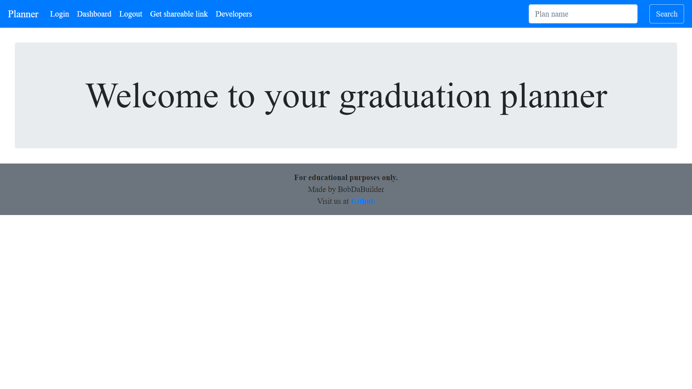
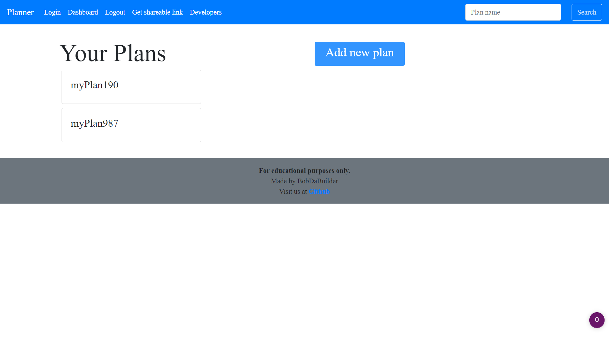
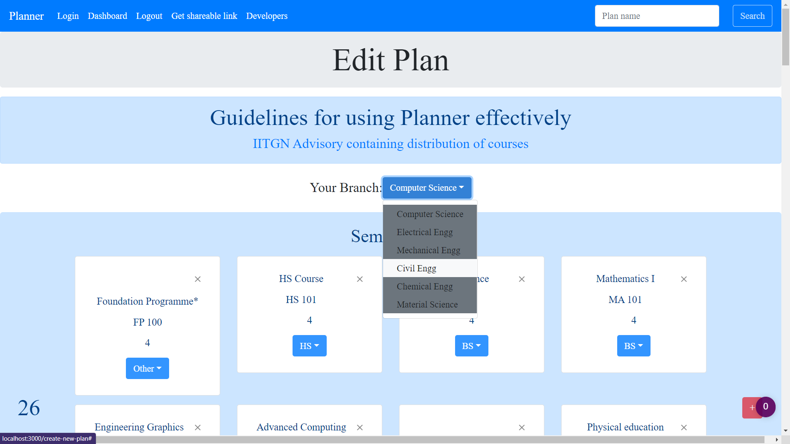
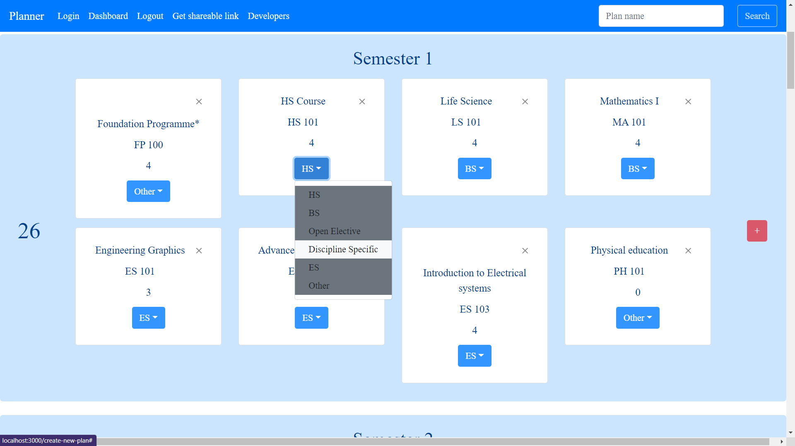
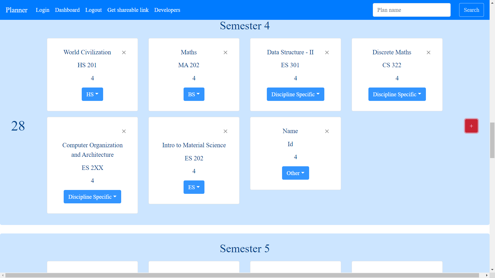
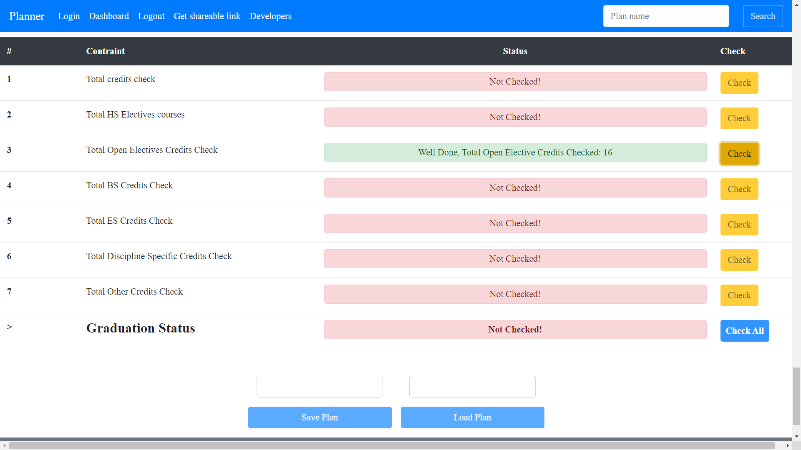
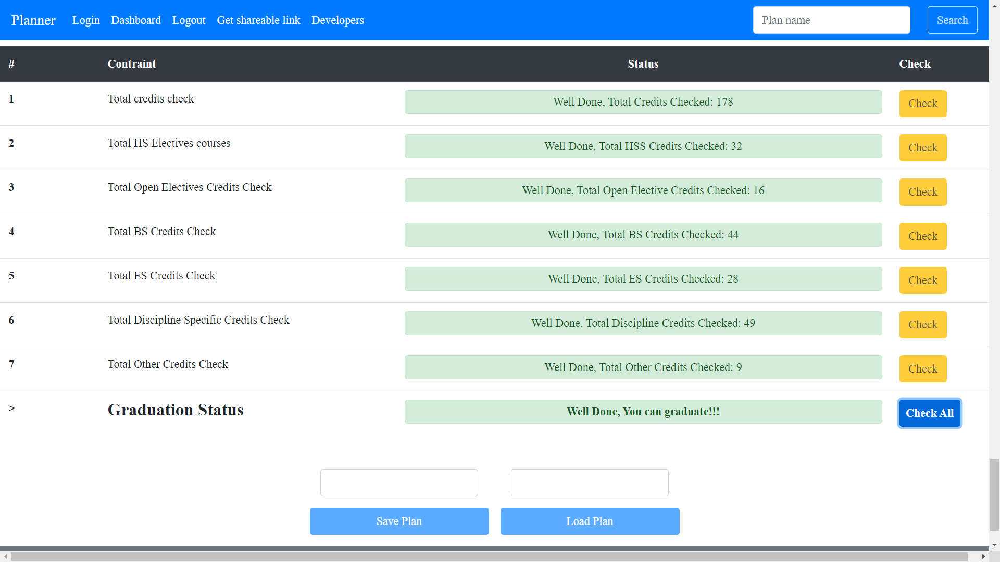
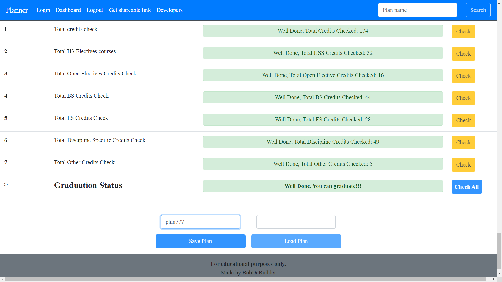
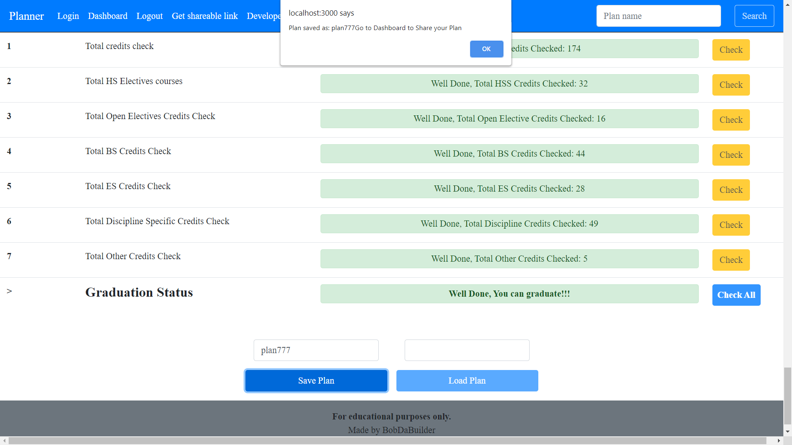
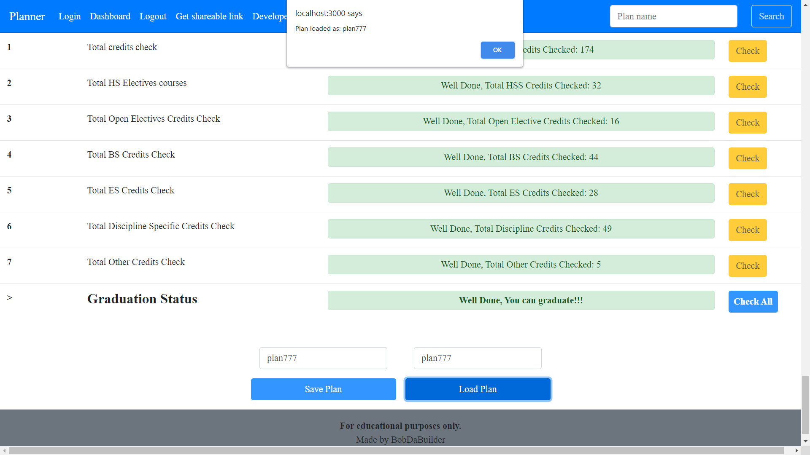
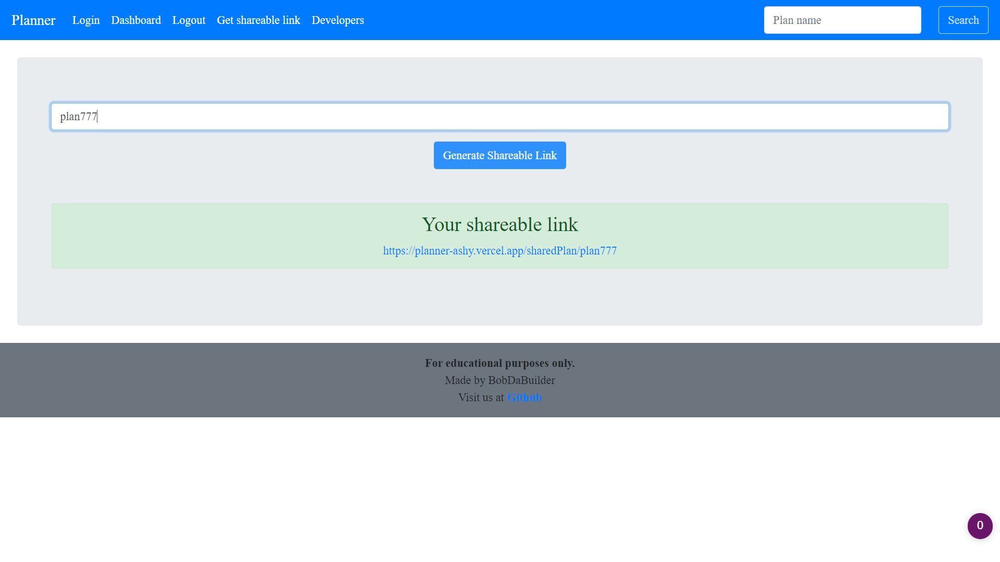
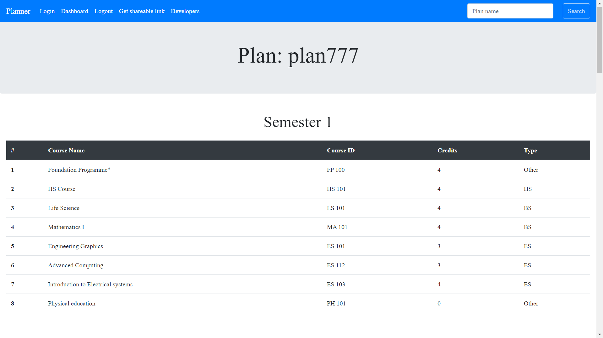
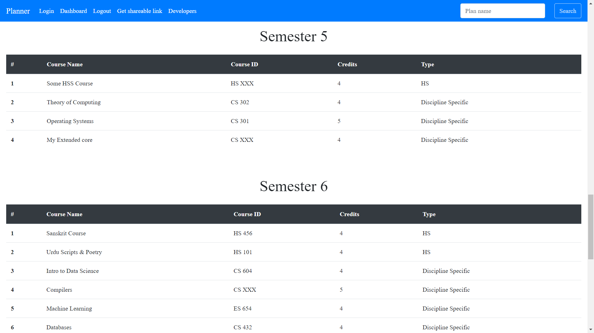
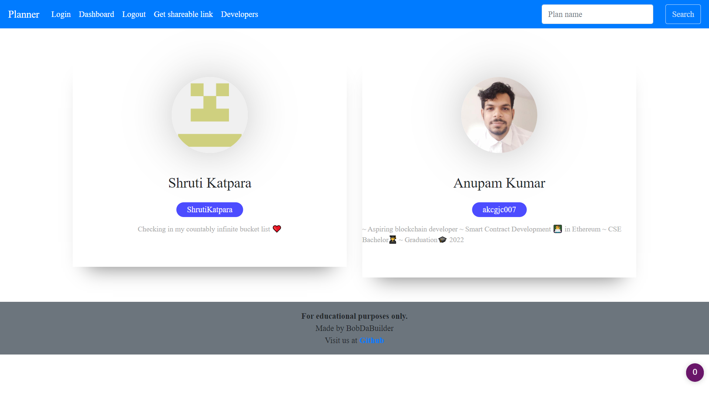

_[Back to Table of Contents](#table-of-contents)_

## [Files & Folders](#files-and-folder)
 - `index.js`: Main server file
 - `models`: Server loading file
 - `initData`: Initial semester & course data
 - `schemas`: Schemas for databases
 - `setDefaultCourses.js`: database initial data
 - `setAllCourses.js`: database initial data
 - `routes`: API routes for end user
 
 - - `client`: Client folder for end user
 - `scrapTimeTable`: scrapping course details from CSV

## [How to run](#how-to-run)
 - `yarn; cd client; yarn;`: Installing dependencies
 - `yarn c`, `yarn s`, `yarn p`: Setting up the database
 - `yarn start`: starting the server
 - `yarn server`: starting the server in dev mode using `nodemon`
 - `yarn client`: starting the client
 - `yarn dev`: starting both server and client concurrently

### `mongod` for Ubuntu:
 - `sudo service mongod start`
 - `sudo service mongod status`
 - `sudo service mongod stop`
 - `sudo service mongod restart`

### Stopping stucked servers in `Ubuntu`
 - `sudo fuser -k 5000/tcp`

### Stopping stucked servers in `Windows`
 - `netstat -ano | findstr :5000`
 - `taskkill /PID <ProcessId> /F`

## Flow of data

### Database storage
 - Default Sem data
 - All courses data
 - Individual plan data

### User's browser
 - User queries server to:
   - load default course data
   - save plan data
   - load plan data
   - load the list of saved plans
 - Computations are done in user's browser

## [Contributors](#contributors)
<table>
  <tr>
    <td align="center">
      <a href="https://github.com/ShrutiKatpara">
          
           
          <b>Shruti Katpara</b>
      </a>
    </td>
    <td align="center">
      <a href="https://github.com/akcgjc007">
          
           
          <b>Anupam Kumar</b>
      </a>
    </td>
  </tr>
</table>

